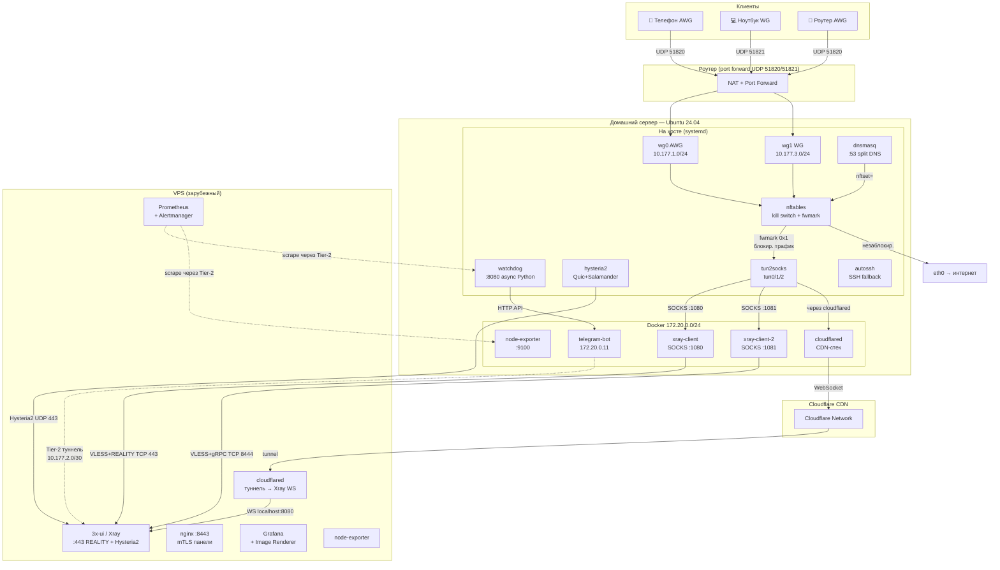
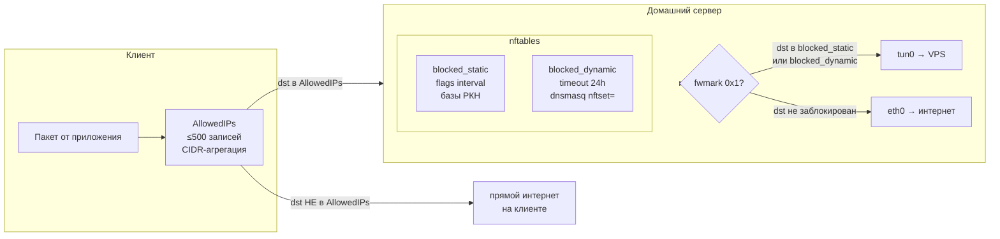
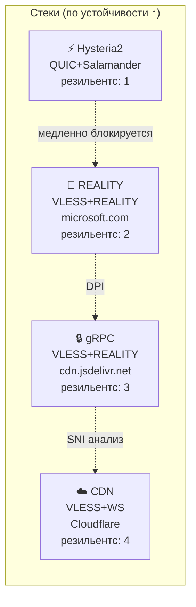
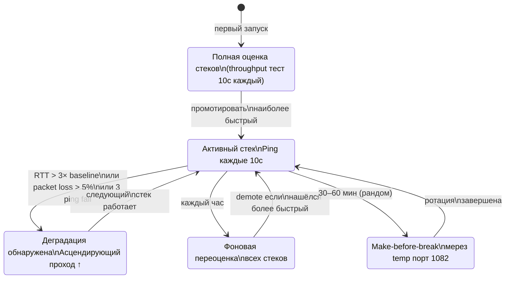
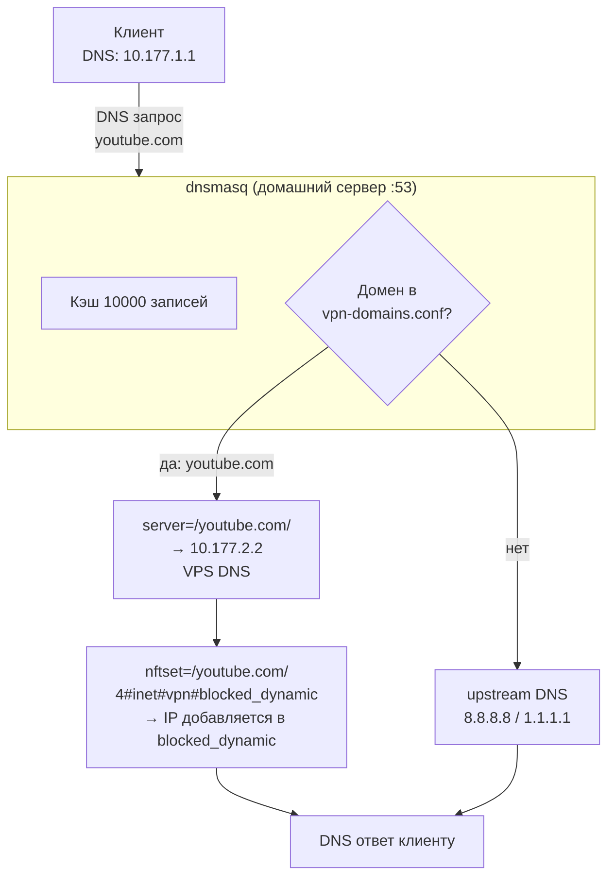
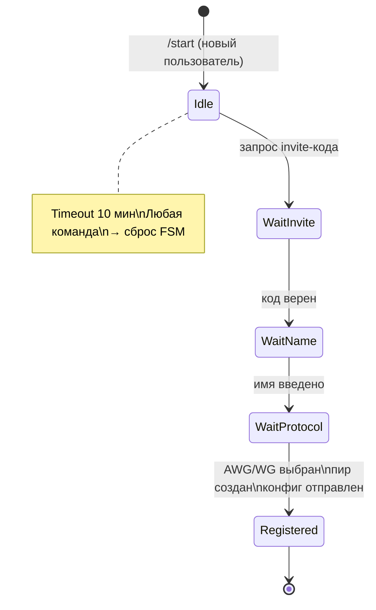
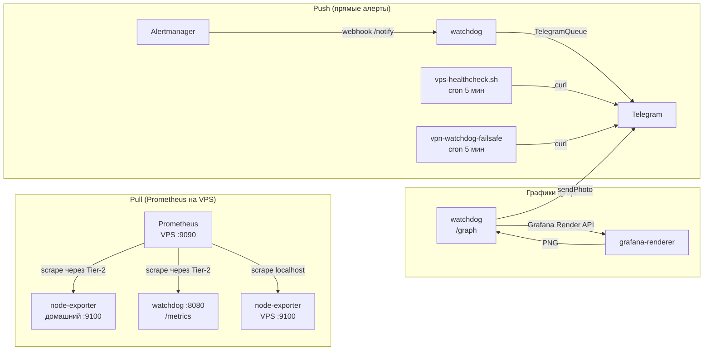

# Архитектура VPN-инфраструктуры

## Содержание

1. [Общая топология](#1-общая-топология)
2. [Адресное пространство](#2-адресное-пространство)
3. [Split Tunneling — Гибрид B+](#3-split-tunneling--гибрид-b)
4. [Четыре стека защищённого соединения](#4-четыре-стека-защищённого-соединения)
5. [Адаптивный failover](#5-адаптивный-failover)
6. [Watchdog — центральный агент](#6-watchdog--центральный-агент)
7. [nftables — два набора правил](#7-nftables--два-набора-правил)
8. [DNS и dnsmasq](#8-dns-и-dnsmasq)
9. [Порядок загрузки systemd](#9-порядок-загрузки-systemd)
10. [Telegram-бот](#10-telegram-бот)
11. [Мониторинг](#11-мониторинг)

---

## 1. Общая топология



---

## 2. Адресное пространство

| Сегмент | Подсеть | Описание |
|---------|---------|----------|
| AWG клиенты | `10.177.1.0/24` | wg0 интерфейс |
| WG клиенты | `10.177.3.0/24` | wg1 интерфейс |
| Tier-2 туннель | `10.177.2.0/30` | домашний ↔ VPS (WireGuard Tier-2) |
| Docker (домашний) | `172.20.0.0/24` | docker bridge br-vpn |
| Docker (VPS) | `172.21.0.0/24` | docker bridge br-vps |
| Альтернативная | `172.29.177.0/24` | при конфликте с офисным /8 |

**Tier-2 туннель:**
- `10.177.2.1` — домашний сервер
- `10.177.2.2` — VPS

Через Tier-2: Prometheus scrape, Watchdog heartbeat, DNS upstream (для заблокированных доменов).

---

## 3. Split Tunneling — Гибрид B+

Два уровня работают совместно:



### Уровень 1 — AllowedIPs на клиенте

Клиент отправляет через VPN только трафик к подсетям из AllowedIPs:
- Крупные AS: Google (AS15169), Meta (AS32934), Cloudflare (AS13335), Akamai, Twitter
- Конкретные CIDR из баз РКН (antifilter, zapret-info, opencck, RockBlack)
- DNS: `10.177.1.1/32` + `1.1.1.1/32` (резервный)
- **Лимит ≤ 500 записей** (CIDR-агрегация через progressive prefix expansion)

### Уровень 2 — nftables на сервере (точный split)

Трафик, попавший на домашний сервер, маршрутизируется:
- `dst ∈ blocked_static` или `dst ∈ blocked_dynamic` → fwmark 0x1 → table 200 → tun
- иначе → table 100 → default via gateway → eth0 (прямой интернет)

### Policy routing

```
ip rule pri 100: fwmark 0x1          → table 200  (blocked → tun)
ip rule pri 150: to 1.1.1.1          → table 200  (DNS через VPN)
ip rule pri 150: to 8.8.8.8          → table 200  (DNS через VPN)
ip rule pri 200: from 10.177.1.0/24  → table 100  (AWG → gateway)
ip rule pri 200: from 10.177.3.0/24  → table 100  (WG  → gateway)

table 200: default dev tun<активный>
table 100: default via <GATEWAY> dev <ETH_IFACE>
```

### Kill Switch (двойная защита)

1. **fwmark routing:** заблокированный трафик → tun; при падении tun → UNREACHABLE → drop
2. **nftables forward chain:** `oifname != "tun*" drop` — стоит **ДО** `ct state established accept`

---

## 4. Четыре стека защищённого соединения

Стеки упорядочены по **устойчивости к блокировкам** (от максимальной):



| Стек | Протокол | Порт | Маскировка | Скорость | Устойчивость |
|------|----------|------|------------|----------|--------------|
| Hysteria2 | QUIC + Salamander | UDP 443 | — | ★★★★★ | ★☆☆☆☆ |
| REALITY | VLESS+TCP | TCP 443 | microsoft.com | ★★★★☆ | ★★★☆☆ |
| gRPC | VLESS+gRPC | TCP 8444 | cdn.jsdelivr.net | ★★★☆☆ | ★★★★☆ |
| CDN | VLESS+WS | TCP 443 (CF) | Cloudflare network | ★★☆☆☆ | ★★★★★ |

### Параметры протоколов

**AmneziaWG:**
```
Jc=4, Jmin=50, Jmax=1000, S1=30, S2=40
H1/H2/H3/H4 = random uint32 (генерируются setup.sh)
PersistentKeepalive=25, MTU=1320
```

**REALITY:**
```
flow:        xtls-rprx-vision (голый), пустой (gRPC)
fingerprint: chrome
dest:        microsoft.com:443 (голый), cdn.jsdelivr.net:443 (gRPC)
```

**Hysteria2:**
```
obfs: salamander, password: из HYSTERIA2_OBFS
quic keepAlive: 20s
bandwidth: up 50, down 200 mbps
```

---

## 5. Адаптивный failover



**Детекция деградации (три типа):**
- Ping fail 3 раза подряд (30 сек) → полная потеря связи
- RTT > 3× от 7-дневного скользящего baseline → latency-деградация
- Speedtest throughput < порог от baseline → шейпинг
  - Маленький (100 KB каждые 5 мин) + большой (10 MB раз в 6ч)
  - Расхождение → детекция объёмного шейпинга

**Make-before-break ротация:**
1. Поднять новое соединение через временный порт 1082
2. Переключить ip route на новый tun
3. Закрыть старое соединение
4. Обрыв: ~1–3 секунды (панели переподключаются сами)

---

## 6. Watchdog — центральный агент

```mermaid
graph TD
    subgraph WATCHDOG["watchdog.py (FastAPI + aiohttp, :8080)"]
        DL[decision_loop\n10с тик]
        TQ[TelegramQueue\nasyncio.Queue + retry×5]
        PM[PluginManager\nSIGHUP hot reload]
        WS[WatchdogState\nrtt_baseline, next_rotation]
    end

    DL -->|ping VPS| PING[ICMP/HTTP]
    DL -->|RTT деградация| SWITCH[_do_switch\nmake-before-break]
    DL -->|стек не работает| FAIL[_do_failover\nascending resilience]

    PM -->|плагины| P1[hysteria2/]
    PM -->|плагины| P2[reality/]
    PM -->|плагины| P3[reality-grpc/]
    PM -->|плагины| P4[cloudflare-cdn/]

    BOT[telegram-bot] -->|HTTP + Bearer| API[REST API\n/status /switch /peer/add ...]
    PROM[Prometheus] -->|scrape| METRICS[/metrics\nvpn_tunnel_*, vpn_peer_*, ...]

    TQ -->|алерты| TG[Telegram API]
```

**API endpoints:**

| Метод | Путь | Описание |
|-------|------|----------|
| GET | `/status` | Статус туннеля, активный стек, пиры |
| GET | `/metrics` | Prometheus-метрики |
| POST | `/switch` | Переключить стек |
| POST | `/peer/add` | Добавить WG peer (mutex) |
| POST | `/peer/remove` | Удалить WG peer |
| POST | `/peer/list` | Список пиров |
| POST | `/routes/update` | Обновить базы РКН |
| POST | `/service/restart` | Перезапустить сервис |
| POST | `/deploy` | Обновить из git |
| POST | `/rollback` | Откат к снимку |
| POST | `/notify-clients` | Разослать конфиги |
| POST | `/graph` | PNG через Grafana Render API |
| POST | `/diagnose/<device>` | Диагностика устройства |
| POST | `/vps/add` | Добавить VPS |
| POST | `/vps/remove` | Удалить VPS |

**Безопасность API:** nftables INPUT accept только `172.20.0.0/24` (Docker-сеть) + Bearer token + rate limit 10 req/sec на все POST.

---

## 7. nftables — два набора правил

```
table inet vpn {
    set blocked_static {
        type ipv4_addr
        flags interval, auto-merge     # CIDR-агрегация
        # содержит: базы РКН, manual-vpn.txt
    }

    set blocked_dynamic {
        type ipv4_addr
        flags timeout
        timeout 24h                     # автоочистка
        gc-interval 1h
        # заполняется dnsmasq через nftset=/domain/4#inet#vpn#blocked_dynamic
    }

    chain prerouting {
        type filter hook prerouting priority mangle
        iifname { "wg0", "wg1" } ip daddr @blocked_static  meta mark set 0x1
        iifname { "wg0", "wg1" } ip daddr @blocked_dynamic meta mark set 0x1
    }

    chain forward {
        type filter hook forward priority filter; policy drop
        # Kill switch: ПЕРЕД ct established (критично!)
        iifname { "wg0", "wg1" } ip daddr @blocked_static  oifname != "tun*" drop
        iifname { "wg0", "wg1" } ip daddr @blocked_dynamic oifname != "tun*" drop
        ct state established,related accept
        iifname { "wg0", "wg1" } oifname <eth> accept
        iifname { "wg0", "wg1" } oifname "tun*" accept
    }

    chain input {
        # Rate limit: UDP flood protection
        iifname <eth> udp dport { 51820, 51821 } limit rate 100/second burst 200 accept
        iifname <eth> udp dport { 51820, 51821 } drop
    }

    chain postrouting {
        type nat hook postrouting priority srcnat
        ip saddr 10.177.1.0/24 oifname <eth> masquerade
        ip saddr 10.177.3.0/24 oifname <eth> masquerade
    }
}
```

**Атомарное обновление blocked_static:**
```bash
# ОДИН вызов nft -f = одна транзакция ядра = ноль окно утечки
flush set inet vpn blocked_static
add element inet vpn blocked_static { 1.2.3.0/24, 5.6.7.0/22, ... }
```

---

## 8. DNS и dnsmasq



**Два конфиг-файла dnsmasq:**
- `vpn-domains.conf` — генерируется из баз РКН + STATIC_BLOCKED_DOMAINS
- `vpn-force.conf` — генерируется из `manual-vpn.txt` (ручные /vpn add)

**Формат директив:**
```
server=/youtube.com/10.177.2.2          # резолв через VPS
nftset=/youtube.com/4#inet#vpn#blocked_dynamic   # IP → в nft set
```

Поддомены покрываются автоматически: `server=/youtube.com/` работает для `*.youtube.com`.

---

## 9. Порядок загрузки systemd

```mermaid
graph TD
    NF[nftables.service\n1. правила ядра + пустые sets] -->
    VR[vpn-sets-restore.service\n2. заполнить blocked_static] -->
    WG0[wg-quick@wg0\n3. AWG интерфейс] -->
    WG1[wg-quick@wg1\n3. WG интерфейс] -->
    VRT[vpn-routes.service\n4. ip rule/route] -->
    DNS[dnsmasq.service\n5. split DNS] -->
    H2[hysteria2.service\n6. QUIC стек] -->
    WD[watchdog.service\n7. Type=notify WatchdogSec=30] -->
    DK[docker.service\n8. все контейнеры] -->
    PB[vpn-postboot.service\n9. проверка + Telegram отчёт]
```

**watchdog.service** — `Type=notify` означает что systemd ждёт `sd_notify(READY=1)` перед тем как пометить сервис запущенным. `WatchdogSec=30` — systemd убивает и перезапускает если нет `WATCHDOG=1` более 30 сек.

---

## 10. Telegram-бот



**Архитектура:**
- `FSMControlMiddleware` (outer) — перехватывает все сообщения, управляет состояниями
- `DependencyMiddleware` — инжектирует db, watchdog_client
- SQLite WAL mode — безопасная конкурентная запись

**Авторассылка конфигов (debounce 5 мин):**
Триггеры: обновление баз РКН, /routes update, одобрение /request, смена IP (без DDNS), /migrate-vps

---

## 11. Мониторинг



**Метрики watchdog** (`/metrics` endpoint):
- `vpn_tunnel_up` — активность туннеля
- `vpn_tunnel_rtt_ms` / `vpn_tunnel_rtt_baseline_ms` — RTT и baseline
- `vpn_tunnel_packet_loss_pct` — потери пакетов
- `vpn_tunnel_download_mbps` / `vpn_tunnel_upload_mbps` — speedtest
- `vpn_active_stack` — номер активного стека
- `vpn_peer_count{interface}` — количество пиров
- `vpn_peer_last_handshake{interface,peer}` — секунды с handshake
- `vpn_dnsmasq_up` — здоровье dnsmasq
- `vpn_routes_cache_age_sec` — возраст кэша баз РКН
- `vpn_cert_days{cert}` — дней до истечения сертификата
- `vpn_docker_healthy{container}` — состояние Docker-контейнеров
- `vpn_failover_total` — счётчик failover
