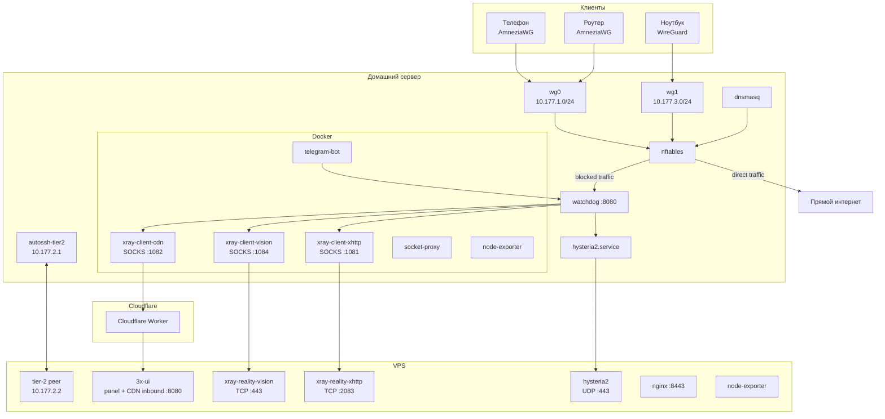

# Архитектура VPN-инфраструктуры v4.0

## Содержание

1. [Цели системы](#1-цели-системы)
2. [Сетевая топология](#2-сетевая-топология)
3. [Адресное пространство](#3-адресное-пространство)
4. [Компоненты домашнего сервера](#4-компоненты-домашнего-сервера)
5. [Компоненты VPS](#5-компоненты-vps)
6. [Tier-2 туннель](#6-tier-2-туннель)
7. [Стеки защищённого соединения](#7-стеки-защищённого-соединения)
8. [Zapret (nfqws)](#8-zapret-nfqws)
9. [Failover и reassessment](#9-failover-и-reassessment)
10. [Split tunneling](#10-split-tunneling)
11. [nftables и policy routing](#11-nftables-и-policy-routing)
12. [Watchdog](#12-watchdog)
13. [Telegram-бот](#13-telegram-бот)
14. [Мониторинг](#14-мониторинг)
15. [Операционные замечания](#15-операционные-замечания)

---

## 1. Цели системы

Инфраструктура решает три задачи:

1. Обход DPI и блокировок РКН без ручных действий пользователя.
2. Split tunneling: через VPS идёт только заблокированный трафик.
3. Простая эксплуатация: клиенты получают WireGuard/AmneziaWG конфиги через Telegram, а домашний сервер сам выбирает рабочий внешний стек.

Клиенты всегда подключаются только к домашнему серверу. Переключение между внешними стеками происходит прозрачно для них.

---

## 2. Сетевая топология



Ключевой смысл:

- клиенты ходят только на домашний сервер;
- заблокированный трафик уходит через активный внешний стек;
- свободный трафик идёт напрямую;
- `watchdog` выбирает активный стек и обновляет маршрутизацию;
- `reality-xhttp` оставлен как experimental и не участвует в автоматическом выборе.

---

## 3. Адресное пространство

| Сегмент | Подсеть | Назначение |
|---|---|---|
| AWG клиенты | `10.177.1.0/24` | клиенты AmneziaWG |
| Tier-2 | `10.177.2.0/30` | служебный туннель дом ↔ VPS |
| WG клиенты | `10.177.3.0/24` | клиенты WireGuard |
| Docker home | `172.20.0.0/24` | контейнеры домашнего сервера |
| Docker VPS | `172.21.0.0/24` | контейнеры VPS |

Tier-2:

- `10.177.2.1` — home
- `10.177.2.2` — VPS

---

## 4. Компоненты домашнего сервера

### systemd

| Сервис | Роль |
|---|---|
| `nftables.service` | базовые таблицы и правила |
| `vpn-sets-restore.service` | восстановление `blocked_static` после reboot |
| `awg-quick@wg0` | AmneziaWG |
| `wg-quick@wg1` | WireGuard |
| `autossh-tier2` | служебный туннель к VPS |
| `vpn-routes.service` | таблицы `vpn` и `marked` |
| `dnsmasq.service` | DNS + `nftset` наполнение |
| `hysteria2.service` | клиент Hysteria2 |
| `watchdog.service` | decision engine и API |

### Docker

| Контейнер | Роль |
|---|---|
| `telegram-bot` | админский и клиентский интерфейс |
| `xray-client-xhttp` | experimental XHTTP, SOCKS `:1081` |
| `xray-client-vision` | штатный TCP fallback, SOCKS `:1084` |
| `xray-client-cdn` | Cloudflare CDN стек, SOCKS `:1082` |
| `socket-proxy` | ограниченный доступ к Docker API |
| `node-exporter` | метрики хоста |

---

## 5. Компоненты VPS

| Контейнер/сервис | Роль |
|---|---|
| `3x-ui` | панель + inbound для CDN стека |
| `xray-reality-vision` | standalone `VLESS+REALITY+Vision` на `TCP 443` |
| `xray-reality-xhttp` | standalone `VLESS+REALITY+XHTTP` на `TCP 2083` |
| `hysteria2` | `UDP 443` |
| `nginx` | mTLS доступ к админке |
| `node-exporter` | метрики VPS |

Текущая схема больше не использует `3x-ui` как хостинг для старых `reality/reality-grpc` inbound’ов. Эти исторические inbound’ы удаляются скриптом `vps/scripts/xray-setup.sh`.

---

## 6. Tier-2 туннель

Tier-2 нужен для служебной связности, не для пользовательского трафика.

Через него идут:

- scrape метрик VPS;
- служебные probes watchdog;
- DNS-резолв для части сценариев;
- операторский доступ и синхронизация.

Главный принцип: Tier-2 не зависит от активного внешнего стека и не должен ломаться при failover.

---

## 7. Стеки защищённого соединения

Ниже указаны именно внешние стеки между home-server и VPS.

### 7.1 Hysteria2

| Параметр | Значение |
|---|---|
| Роль | текущий primary |
| Транспорт | QUIC |
| Порт VPS | `UDP 443` |
| Преимущество | быстрый и уже рабочий |
| Ограничение | QUIC проще фильтровать |

### 7.2 VLESS + REALITY + Vision

| Параметр | Значение |
|---|---|
| Роль | штатный TCP fallback |
| Транспорт | TCP |
| Порт VPS | `TCP 443` |
| Home SOCKS | `127.0.0.1:1084` |
| Маскировка | `www.microsoft.com` |
| Участие в автоматике | да |

Это основной TCP-резерв для watchdog.

### 7.3 VLESS + REALITY + XHTTP

| Параметр | Значение |
|---|---|
| Роль | experimental |
| Транспорт | XHTTP |
| Порт VPS | `TCP 2083` |
| Home SOCKS | `127.0.0.1:1081` |
| Маскировка | `cdn.jsdelivr.net` |
| Участие в автоматике | нет |

Стек сохранён только для ручных тестов и исследований transport compatibility. По текущему состоянию формально поднимается, но data path нестабилен.

### 7.4 Cloudflare CDN

| Параметр | Значение |
|---|---|
| Роль | наиболее устойчивый обход |
| Транспорт | HTTPS через Cloudflare Worker |
| Home SOCKS | `127.0.0.1:1082` |
| Участие в автоматике | да |

---

## 8. Zapret (nfqws)

`zapret` работает параллельно и решает другую задачу:

- не заменяет VPN-стек;
- помогает с DPI-throttling на прямом трафике;
- не решает IP-level блокировки.

Он используется для `dpi_direct` трафика через отдельную policy routing ветку.

---

## 9. Failover и reassessment

### Текущее правило ролей

- `hysteria2` — текущий primary;
- `vless-reality-vision` — штатный TCP standby;
- `cloudflare-cdn` — более устойчивый внешний fallback;
- `reality-xhttp` — только experimental/manual.

### Что делает watchdog

1. Следит за health и reachability.
2. Хранит `active_stack`.
3. Пишет `/var/run/vpn-active-stack` и `/var/run/vpn-active-socks-port`.
4. Переключает `table marked`.
5. Делает hourly reassessment и standby checks.

### Что исключено из автоматики

Плагин с:

- `experimental: true`
- `auto_enabled: false`

остаётся видимым в API и UI, но не участвует в:

- `test_standby_tunnels()`
- `_full_reassessment()`
- `_failover_impl()`

Именно так сейчас обрабатывается `reality-xhttp`.

---

## 10. Split tunneling

Два уровня:

1. `AllowedIPs` на клиентах ограничивают трафик, который вообще приходит на home-server.
2. На home-server `nftables` и `ip rule` решают, что идёт:
   - через VPS,
   - напрямую,
   - через `zapret`.

Категории трафика:

- `blocked_static` → через активный VPN стек;
- `blocked_dynamic` → через активный VPN стек;
- `dpi_direct` → напрямую через `zapret`;
- остальное → прямой интернет.

---

## 11. nftables и policy routing

Используются основные таблицы:

- `vpn` (`table 100`) — прямой трафик;
- `marked` (`table 200`) — трафик через активный внешний стек;
- `dpi` (`table 201`) — прямой трафик через `zapret`.

`watchdog` меняет `table marked` при переключении стеков.

Если активный стек не поднят, система может переводить `table marked` в `unreachable`, чтобы blocked-трафик не утекал наружу.

---

## 12. Watchdog

`watchdog.py` — центральный decision engine.

Основные функции:

- API `/status`, `/metrics`, `/health`;
- ротация и failover стеков;
- health score;
- уведомления в Telegram;
- управление state-файлами и policy routing;
- reassessment и standby tests.

Плагины загружаются из `/opt/vpn/watchdog/plugins/<stack>/`.

Критически важно: изменения нужно вносить в шаблоны и скрипты генерации, а не в продовые файлы вручную.

---

## 13. Telegram-бот

Бот предоставляет:

- выдачу клиентских конфигов;
- админское меню;
- `/status`, `/tunnel`, `/switch`, `/logs`, `/assess`;
- уведомления от watchdog и post-install проверок.

В UI сейчас:

- `REALITY + Vision` — штатный TCP fallback;
- `REALITY + XHTTP (exp)` — явно экспериментальный стек.

---

## 14. Мониторинг

Мониторинг сейчас живёт в основном на home-server:

- `Prometheus`
- `Grafana`
- `Alertmanager`
- `node-exporter`

VPS даёт:

- `node-exporter`
- healthcheck-скрипт
- сервисные контейнеры, которые проверяются отдельно

---

## 15. Операционные замечания

### Проверенный install path

Единственный поддерживаемый способ установки:

```bash
curl -fsSL https://raw.githubusercontent.com/Cyrillicspb/vpn-infra/master/install.sh | sudo bash
```

### Что нужно помнить

- `reality-xhttp` намеренно оставлен в системе, но он experimental.
- `post-install-check.sh` должен знать про `xray-client-vision` и `vless-reality-vision`.
- при переустановке именно генераторы должны восстанавливать runtime-конфиги:
  - `setup.sh`
  - `install-home.sh`
  - `install-vps.sh`
  - `vps/scripts/render-reality-vision-config.sh`
  - `vps/scripts/render-reality-xhttp-config.sh`

### Текущая рабочая модель

На момент этой версии рабочая схема такая:

- `hysteria2` проводит трафик;
- `vless-reality-vision` проводит трафик и готов как TCP fallback;
- `reality-xhttp` формально поднят, но не считается надёжным data path;
- `cloudflare-cdn` остаётся наиболее устойчивым обходом при необходимости.
