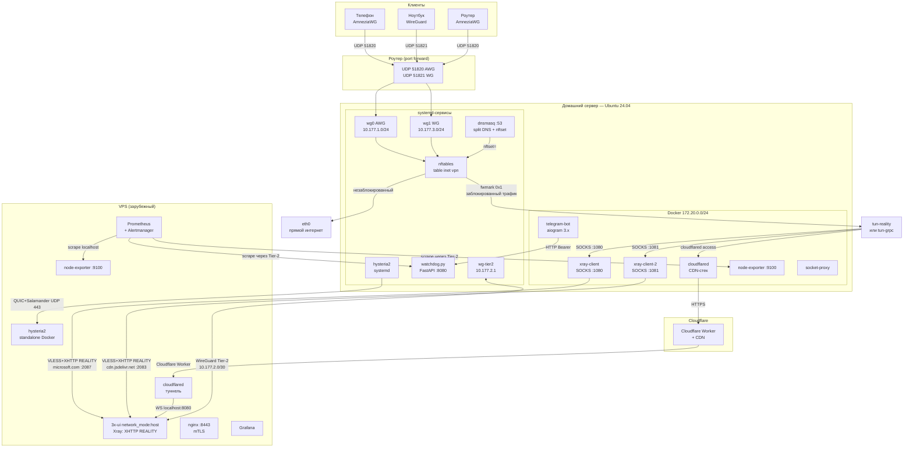
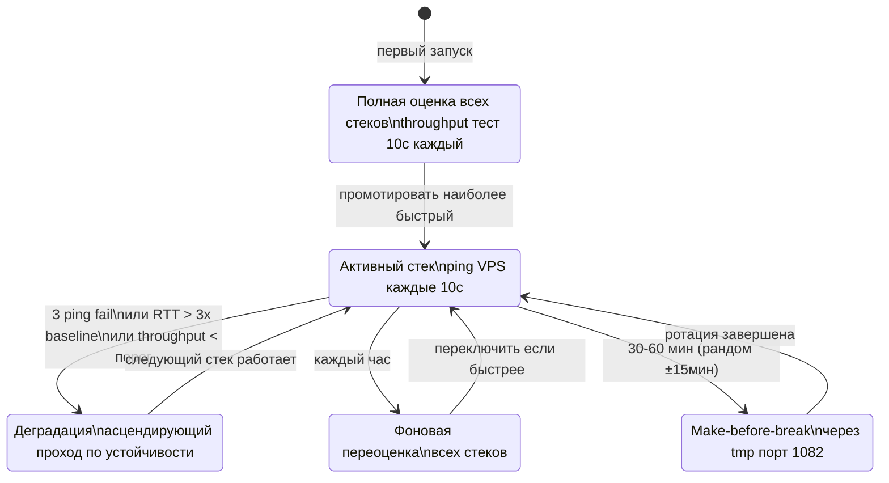

# Архитектура VPN-инфраструктуры v4.0

## Содержание

1. [Цели системы](#1-цели-системы)
2. [Сетевая топология](#2-сетевая-топология)
3. [Адресное пространство](#3-адресное-пространство)
4. [Компоненты домашнего сервера](#4-компоненты-домашнего-сервера)
5. [Компоненты VPS](#5-компоненты-vps)
6. [Tier-2 туннель](#6-tier-2-туннель)
7. [Четыре стека защищённого соединения](#7-четыре-стека-защищённого-соединения)
8. [Zapret (nfqws) — параллельный DPI bypass](#8-zapret-nfqws--параллельный-dpi-bypass)
9. [Адаптивный failover](#9-адаптивный-failover)
10. [Split Tunneling — Гибрид B+](#10-split-tunneling--гибрид-b)
11. [nftables — правила и наборы](#11-nftables--правила-и-наборы)
12. [DNS и dnsmasq](#12-dns-и-dnsmasq)
13. [Policy routing](#13-policy-routing)
14. [Watchdog — центральный агент](#14-watchdog--центральный-агент)
15. [Telegram-бот](#15-telegram-бот)
16. [Мониторинг](#16-мониторинг)
17. [Безопасность](#17-безопасность)
18. [Автообновления](#18-автообновления)

---

## 1. Цели системы

Инфраструктура решает три конкретные проблемы:

**1. Обход DPI-фильтрации (ТСПУ/РКН).** Российские провайдеры применяют глубокую инспекцию пакетов для блокировки сервисов. Система маскирует трафик под легитимные HTTPS-соединения к крупным CDN и облачным провайдерам. При блокировке одного метода автоматически переключается на другой.

**2. Split tunneling без компромиссов.** Весь незаблокированный трафик идёт напрямую через домашнее соединение — не замедляется, не нагружает VPS. Через VPN проходит только то, что заблокировано. Списки обновляются автоматически ночью из баз РКН.

**3. Распространение среди нетехнических пользователей.** Клиент получает `.conf` файл через Telegram, импортирует в WireGuard/AmneziaWG и больше ни о чём не думает. Все переключения стеков, обновления маршрутов, мониторинг — прозрачны для клиента.

**Для кого:** небольшая группа доверенных пользователей (семья, коллеги), управляемая одним администратором.

**Почему два уровня (двухуровневая):** домашний сервер обслуживает клиентов по WireGuard (знакомый протокол, простые конфиги, низкая латентность внутри сети). Сам домашний сервер подключается к VPS за рубежом через один из четырёх стеков, устойчивых к блокировкам. Такая схема позволяет менять стеки на VPS без пересоздания конфигов у клиентов.

---

## 2. Сетевая топология



**ASCII-схема потока трафика:**

```
Клиент → Роутер (port forward) → Домашний сервер
                                        │
                              nftables prerouting
                            dst ∈ blocked? ──────────────────────────────┐
                                │ нет                                     │ да
                                ▼                                         ▼
                          table vpn (100)                        fwmark 0x1
                          via gateway eth0                        │
                          прямой интернет                  table marked (200)
                                                           via tun-* (активный)
                                                                  │
                                             ┌────────────────────┴────────────────────┐
                                             │                                         │
                                       XHTTP/REALITY                            CDN/Hysteria2
                                       VPS :2083 / :2087                   Cloudflare / UDP 443
```

---

## 3. Адресное пространство

| Сегмент | Подсеть | Интерфейс | Описание |
|---------|---------|-----------|----------|
| AWG клиенты | `10.177.1.0/24` | wg0 | AmneziaWG, DNS: 10.177.1.1 |
| Tier-2 туннель | `10.177.2.0/30` | wg-tier2 | дом (.1) ↔ VPS (.2) |
| WG клиенты | `10.177.3.0/24` | wg1 | WireGuard, DNS: 10.177.3.1 |
| Docker домашний | `172.20.0.0/24` | br-vpn | все контейнеры дома |
| Docker VPS | `172.21.0.0/24` | br-vps | контейнеры VPS |
| Альтернативная | `172.29.177.0/24` | wg0/wg1 | при конфликте с офисным /8 |

**Tier-2 туннель:**
- `10.177.2.1` — домашний сервер (инициатор)
- `10.177.2.2` — VPS (peer)

---

## 4. Компоненты домашнего сервера

### Порядок загрузки systemd

| № | Сервис | Тип | Роль |
|---|--------|-----|------|
| 1 | `nftables.service` | oneshot | Загружает `/etc/nftables.conf`: создаёт `table inet vpn`, цепочки, пустые sets |
| 2 | `vpn-sets-restore.service` | oneshot | `nft -f /etc/nftables-blocked-static.conf` — заполняет `blocked_static` из файла |
| 3 | `awg-quick@wg0` | simple | AmneziaWG интерфейс, клиентская подсеть 10.177.1.0/24, порт 51820 |
| 4 | `wg-quick@wg1` | simple | WireGuard интерфейс, клиентская подсеть 10.177.3.0/24, порт 51821 |
| 5 | `autossh-tier2` | simple | Tier-2 SSH tun туннель к VPS, tun0, 10.177.2.1↔10.177.2.2, TCP 22/443 |
| 6 | `vpn-routes.service` | oneshot | Создаёт ip rule и ip route для таблиц `vpn` (100) и `marked` (200) |
| 7 | `dnsmasq.service` | simple | Split DNS: резолв заблокированных доменов через VPS, nftset= для blocked_dynamic |
| 8 | `hysteria2.service` | simple | QUIC+Salamander клиент, управляется watchdog (стек hysteria2) |
| 9 | `watchdog.service` | notify | FastAPI Python, Type=notify, WatchdogSec=30, управляет стеками |
| 10 | `docker.service` | — | Все контейнеры с `restart: always` стартуют автоматически |
| 11 | `vpn-postboot.service` | oneshot | Проверяет состояние после загрузки, отправляет отчёт в Telegram |

### Docker-контейнеры (домашний сервер)

| Контейнер | Образ | Порт/Сокет | Роль |
|-----------|-------|-----------|------|
| `telegram-bot` | локальный build | — | Telegram-бот, aiogram 3.x, SQLite WAL |
| `xray-client` | `teddysun/xray:latest` | SOCKS :1080 | Xray-клиент для стека reality (XHTTP/microsoft.com) |
| `xray-client-2` | `teddysun/xray:latest` | SOCKS :1081 | Xray-клиент для стека reality-grpc (XHTTP/cdn.jsdelivr.net) |
| `cloudflared` | `cloudflare/cloudflared` | — | CDN-стек: cloudflared access → Cloudflare Worker → VPS |
| `socket-proxy` | `tecnativa/docker-socket-proxy` | TCP :2375 | Безопасный проброс Docker socket для бота и Portainer |
| `node-exporter` | `prom/node-exporter` | :9100 | Метрики хоста для Prometheus |

---

## 5. Компоненты VPS

### Docker-контейнеры VPS

| Контейнер | Образ | network_mode / Порт | Роль |
|-----------|-------|-------------------|------|
| `3x-ui` | `ghcr.io/mhsanaei/3x-ui` | `host` | Xray-сервер: VLESS+XHTTP+REALITY инбаунды на портах 2083 и 2087 |
| `nginx` | `nginx:alpine` | :8443 | mTLS reverse proxy: панели, Prometheus endpoint |
| `cloudflared` | `cloudflare/cloudflared` | — | CDN-стек: туннель Cloudflare → localhost:8080 (Xray WS inbound) |
| `hysteria2` | `tobyxdd/hysteria` | UDP :443 | Standalone Hysteria2-сервер (Salamander obfs) |
| `prometheus` | `prom/prometheus` | :9090 | Pull-метрики: scrape домашний сервер через Tier-2 |
| `alertmanager` | `prom/alertmanager` | :9093 | Алерты → webhook → watchdog → Telegram |
| `grafana` | `grafana/grafana` | :3000 | Dashboards + Image Renderer для /graph |
| `node-exporter` | `prom/node-exporter` | :9100 | Метрики VPS-хоста |

**3x-ui инбаунды:**

| Имя | Порт | Протокол | SNI (REALITY dest) |
|-----|------|----------|--------------------|
| VLESS-XHTTP-jsdelivr | TCP 2083 | VLESS + splithttp + REALITY | cdn.jsdelivr.net |
| VLESS-XHTTP-microsoft | TCP 2087 | VLESS + splithttp + REALITY | microsoft.com |

---

## 6. Tier-2 туннель

**Что это:** SSH tun туннель (autossh -w) между домашним сервером (10.177.2.1, tun0) и VPS (10.177.2.2, tun0). Работает всегда, независимо от активного стека обхода блокировок. Использует TCP порт 22 или 443 — не требует открытия отдельного UDP-порта на VPS.

**Зачем нужен:**
- Prometheus на VPS scrape-ит метрики домашнего сервера (node-exporter :9100, watchdog /metrics) через этот туннель
- Watchdog отправляет heartbeat к VPS каждые 60 секунд через Tier-2
- dnsmasq резолвит заблокированные домены через DNS VPS (`server=/youtube.com/10.177.2.2`)
- SSH-доступ к VPS с домашнего сервера для деплоя и синхронизации git-зеркала

**Почему отдельный туннель, а не через стек обхода:** стеки обхода могут переключаться при failover. Tier-2 — стабильный служебный канал, не зависящий от состояния основных стеков.

---

## 7. Четыре стека защищённого соединения

Стеки упорядочены по устойчивости к блокировкам от наименее (1) до наиболее (4) устойчивого:

### Стек 1 — Hysteria2

| Параметр | Значение |
|----------|----------|
| Протокол | QUIC + Salamander obfuscation |
| Порт | UDP 443 |
| Маскировка | нет (QUIC-паттерн виден DPI) |
| Скорость | максимальная |
| Устойчивость | минимальная — QUIC легко блокируется |

**Как работает:** клиентский `hysteria2.service` (systemd) подключается к standalone `hysteria2` контейнеру на VPS. Watchdog управляет запуском/остановкой сервиса. tun2socks поднимает TUN-интерфейс поверх SOCKS5, который предоставляет Hysteria2.

### Стек 2 — reality (XHTTP/microsoft.com)

| Параметр | Значение |
|----------|----------|
| Протокол | VLESS + splithttp (XHTTP) + REALITY |
| Порт | TCP 2087 на VPS |
| SNI / dest | microsoft.com |
| SOCKS-прокси | xray-client → localhost:1080 |
| tun-интерфейс | tun-reality |
| Устойчивость | средняя — REALITY маскирует под TLS к Microsoft |

**Как работает:** `xray-client` (Docker) подключается через XHTTP/splithttp к VPS:2087. 3x-ui на VPS обрабатывает соединение через инбаунд VLESS-XHTTP-microsoft. tun2socks поднимает `tun-reality` поверх SOCKS5 :1080.

### Стек 3 — reality-grpc (XHTTP/cdn.jsdelivr.net)

| Параметр | Значение |
|----------|----------|
| Протокол | VLESS + splithttp (XHTTP) + REALITY |
| Порт | TCP 2083 на VPS |
| SNI / dest | cdn.jsdelivr.net |
| SOCKS-прокси | xray-client-2 → localhost:1081 |
| tun-интерфейс | tun-grpc |
| Устойчивость | высокая — cdn.jsdelivr.net типичен для CDN-трафика |

**Как работает:** аналогично стеку reality, но использует `xray-client-2` и другой инбаунд на VPS. Имя `reality-grpc` историческое (ранее использовался gRPC, сейчас splithttp/XHTTP).

### Стек 4 — CDN (VLESS+WS через Cloudflare)

| Параметр | Значение |
|----------|----------|
| Протокол | VLESS + WebSocket → Cloudflare Worker → VPS |
| Транспорт | HTTPS через Cloudflare CDN |
| Компоненты | cloudflared (дом) + Cloudflare Worker + cloudflared (VPS) |
| tun-интерфейс | управляется плагином cloudflare-cdn |
| Устойчивость | максимальная — блокировка = блокировка Cloudflare |

**Как работает:** `cloudflared` на домашнем сервере (Docker) устанавливает соединение через Cloudflare Access к туннелю. Cloudflare Worker проксирует трафик к `cloudflared` на VPS, который передаёт его на Xray WebSocket inbound на localhost:8080.

### Параметры AmneziaWG

```
Jc=4, Jmin=50, Jmax=1000, S1=30, S2=40
H1/H2/H3/H4 = random uint32 (генерируются setup.sh)
PersistentKeepalive=25, MTU=1320
```

---

## 8. Zapret (nfqws) — параллельный DPI bypass

Zapret — **не стек**, работает параллельно с четырьмя стеками. Обходит SNI-throttling (замедление), но **не обходит IP-блокировки** (для них нужны стеки).

### Что делает

nfqws перехватывает TCP-пакеты через Linux Netfilter Queue (NFQUEUE) в цепочке FORWARD и применяет DPI-десинхронизацию: разбивает TCP-хендшейк на части так, чтобы DPI-оборудование провайдера не могло собрать полный SNI. Браузер при этом видит нормальное соединение.

**Ограничение AR1:** nfqws перехватывает только **TCP**. YouTube QUIC (UDP 443) идёт без nfqws-обработки — QUIC-шейпинг остаётся. Решение: принудить браузер использовать TCP (блокировать UDP 443 на клиенте).

### Архитектура

```
nftables prerouting → dst ∈ dpi_direct → fwmark 0x2 → table dpi (201) → eth0

nftables FORWARD chain:
  ip protocol tcp iifname { "wg0", "wg1" } ip daddr @dpi_direct
  → nfqueue num 200  (= nfqws daemon, /opt/vpn/plugins/zapret/bin/nfqws)

nfqws → модифицирует TCP SYN/data → десинхронизирует DPI → пакеты уходят через eth0
```

### Thompson Sampling

Zapret использует 17 пресетов DPI-desync. Thompson Sampling автоматически выбирает эффективный пресет для каждого сервиса:
- Каждый пресет имеет alpha (успехи) и beta (неудачи)
- Ночной probe (02:30): тест всех пресетов → обновление alpha/beta
- **Ограничение AR2:** без decay — при смене DPI-конфигурации ISP сходимость медленная

### Управление

```
/dpi status                  — статус nfqws, активные пресеты
/dpi on / /dpi off           — включить/выключить глобально
/dpi add <домен|пресет>      — добавить домен в dpi_direct
/dpi remove <имя>            — удалить
```

Бинарники nfqws бандлируются в репо (`home/watchdog/plugins/zapret/bin/`) — GitHub заблокирован из РФ, поэтому нельзя скачивать при установке.

### Ограничение AR3

`nft -f` при `check_nftables_integrity` сбрасывает `blocked_dynamic` и `dpi_direct`. dnsmasq не знает о сбросе → sets пустые до следующих DNS-запросов клиентов.

---

## 9. Адаптивный failover

### Алгоритм



### Детекция деградации

Три независимых типа:

1. **Полная потеря связи:** 3 ping fail подряд за 30 секунд → немедленный failover
2. **Latency-деградация:** RTT > 3× от 7-дневного скользящего baseline → failover
3. **Шейпинг:** throughput ниже порога от baseline:
   - Маленький тест: 100 KB каждые 5 минут (детекция базового шейпинга)
   - Большой тест: 10 MB каждые 6 часов (детекция объёмного шейпинга)
   - Расхождение между маленьким и большим тестом → детекция порогового шейпинга

### Порядок переключения при failover

Переход **только вверх по шкале устойчивости** (не прыжок сразу на CDN):

```
Hysteria2 (1) → reality (2) → reality-grpc (3) → CDN (4)
```

При деградации стека N watchdog тестирует N+1. Если не работает — N+2 и т.д.
Worst case: от Hysteria2 до CDN ≈ 30 секунд (3 теста × 10 сек).

### Make-before-break ротация

Ротация соединений (анти-DPI, интервал 30–60 мин рандомный):

1. Поднять новое соединение через временный порт 1082
2. Дождаться успешного подключения к новому tun
3. Переключить `ip route` в таблице `marked` на новый tun
4. Закрыть старое соединение
5. Обрыв трафика: ≈1–3 секунды

### Восстановление

- Фоновая полная переоценка всех стеков раз в час
- Если более быстрый стек восстановился → promot на роль primary
- Protocol failback: автоматически
- VPS failback: с подтверждением администратора

---

## 10. Split Tunneling — Гибрид B+

Два уровня работают одновременно и дополняют друг друга.

### Уровень 1 — AllowedIPs на клиенте

WireGuard-клиент отправляет через VPN только трафик к подсетям из `AllowedIPs`:

- Крупные AS CDN-провайдеров: Google, Meta, Cloudflare, Akamai, Twitter (агрегированные CIDR)
- Конкретные CIDR из баз РКН: antifilter.download, community.antifilter.download, iplist.opencck.org, zapret-info/z-i, RockBlack-VPN
- DNS-серверы: `10.177.1.1/32` (AWG) / `10.177.3.1/32` (WG) + `1.1.1.1/32` резервный
- **Лимит: ≤ 500 записей** (CIDR-агрегация через progressive prefix expansion)

Всё остальное — идёт напрямую через интернет-соединение клиента, VPN не нагружается.

### Уровень 2 — nftables fwmark на домашнем сервере

Трафик, попавший на домашний сервер через wg0/wg1, проходит через `prerouting`. Три категории:

```
dst ∈ blocked_static  → meta mark 0x1  → table marked (200) → tun-* (VPS)
dst ∈ blocked_dynamic → meta mark 0x1  → table marked (200) → tun-* (VPS)
dst ∈ dpi_direct      → meta mark 0x2  → table dpi (201)    → eth0 + nfqws TCP
dst — свободный       → без mark       → table vpn (100)    → via gateway eth0
```

**blocked** — IP заблокирован РКН или в ручном VPN-списке → трафик через активный стек (VPS).

**dpi_direct** — домен замедляется DPI (SNI-throttling), но не заблокирован → трафик напрямую через eth0, но TCP-пакеты проходят через nfqws (DPI десинхронизация).

**свободный** — российские и другие незаблокированные ресурсы → прямой выход в интернет.

### blocked_static

- Содержимое: базы РКН + `manual-vpn.txt`
- Обновление: cron 03:00 ежесуточно, скрипт `update-routes.py`
- Обновление атомарное: `nft -f` генерирует полный файл → одна транзакция ядра, без окна утечки
- Восстановление после перезагрузки: `vpn-sets-restore.service` читает `/etc/nftables-blocked-static.conf`

### blocked_dynamic

- Источник: dnsmasq через директиву `nftset=/domain/4#inet#vpn#blocked_dynamic`
- При DNS-резолве заблокированного домена IP автоматически добавляется в set
- Timeout 24h: записи удаляются сами, `gc-interval 1h`
- После перезагрузки: пустой → dnsmasq прогрев DNS-кэша (`dns-warmup.sh`) наполнит

### Kill switch (двойная защита)

Два независимых механизма блокируют утечку заблокированного трафика через eth0:

**1. fwmark routing:**
- Заблокированный трафик помечен fwmark 0x1 → таблица marked → dev tun-*
- При падении tun-интерфейса: маршрут исчезает → kernel возвращает UNREACHABLE → пакет дропается
- Незаблокированный трафик продолжает работать через eth0

**2. nftables forward chain (явное DROP):**
```
iifname { "wg0", "wg1" } ip daddr @blocked_static  oifname != "tun*" drop
iifname { "wg0", "wg1" } ip daddr @blocked_dynamic oifname != "tun*" drop
```
Правило стоит **до** `ct state established,related accept` — это критично.

### Обновление баз маршрутов (cron 03:00)

Источники (per-source кэш, при недоступности → предыдущая версия):

**Реестры блокировок (→ blocked_static):**
- `antifilter.download` — IP из реестра РКН
- `community.antifilter.download` — расширенный сообщественный реестр
- `iplist.opencck.org` — альтернативный реестр
- `github.com/zapret-info/z-i` — прямая выгрузка Роскомнадзора
- `github.com/RockBlack-VPN` — **геоблок**: 230+ западных сервисов, недоступных в РФ по географическому признаку (ChatGPT, Claude, Notion и др.)

**Статические (→ AllowedIPs на клиенте):**
- Агрегированные AS-подсети CDN (Google, Meta, Cloudflare и др.) — в репозитории

**Ручные списки:**
- `/etc/vpn-routes/manual-vpn.txt` — домены/подсети принудительно через VPN
- `/etc/vpn-routes/manual-direct.txt` — домены/подсети принудительно напрямую

Валидация: формат IP/CIDR, размер >100 записей, дельта <50% от предыдущей версии.
Конкурентный доступ: `flock /var/run/vpn-routes.lock`.
Алерт при возрасте кэша >3 дней.

---

## 11. nftables — правила и наборы

Вся логика — в единой таблице `inet vpn`.

```
table inet vpn {

    # --- НАБОРЫ ---

    set blocked_static {
        type ipv4_addr
        flags interval, auto-merge
        # Источник: базы РКН, обновляются cron 03:00
        # Восстанавливаются vpn-sets-restore.service после перезагрузки
    }

    set blocked_dynamic {
        type ipv4_addr
        flags timeout
        timeout 24h
        gc-interval 1h
        # Заполняется dnsmasq через nftset= при DNS-резолве заблокированных доменов
    }

    set dpi_direct {
        type ipv4_addr
        flags timeout
        timeout 24h
        gc-interval 1h
        # Заполняется dnsmasq через nftset= для SNI-throttled доменов
        # Трафик идёт напрямую через eth0 + nfqws TCP-обработка
    }

    # --- ЦЕПОЧКИ ---

    chain prerouting {
        type filter hook prerouting priority mangle; policy accept;
        # Пометить заблокированный трафик → VPS
        iifname { "wg0", "wg1" } ip daddr @blocked_static  meta mark set 0x1
        iifname { "wg0", "wg1" } ip daddr @blocked_dynamic meta mark set 0x1
        # Пометить dpi_direct трафик → eth0 + nfqws
        iifname { "wg0", "wg1" } ip daddr @dpi_direct      meta mark set 0x2
    }

    chain forward {
        type filter hook forward priority filter; policy drop;
        # Kill switch: ПЕРЕД ct established (критично для корректной защиты)
        iifname { "wg0", "wg1" } ip daddr @blocked_static  oifname != "tun*" drop
        iifname { "wg0", "wg1" } ip daddr @blocked_dynamic oifname != "tun*" drop
        # nfqws: перехватить TCP к dpi_direct для DPI-десинхронизации
        iifname { "wg0", "wg1" } ip daddr @dpi_direct ip protocol tcp \
            nfqueue num 200
        # Разрешить установленные соединения
        ct state established,related accept
        # Разрешить WG-клиентам выход в интернет и в tun
        iifname { "wg0", "wg1" } oifname <ETH_IFACE> accept
        iifname { "wg0", "wg1" } oifname "tun*"      accept
    }

    chain input {
        type filter hook input priority filter; policy drop;
        # Защита от UDP flood на WG-портах
        iifname <ETH_IFACE> udp dport { 51820, 51821 } \
            limit rate 100/second burst 200 packets accept
        iifname <ETH_IFACE> udp dport { 51820, 51821 } drop
        # Watchdog API: только из Docker-сети
        tcp dport 8080 ip saddr 172.20.0.0/24 accept
        tcp dport 8080 drop
        # Tier-2 SSH tun туннель использует TCP 22/443 — отдельного правила не нужно
        # Loopback, established
        iifname "lo" accept
        ct state established,related accept
    }

    chain postrouting {
        type nat hook postrouting priority srcnat; policy accept;
        # NAT для трафика WG-клиентов, уходящего в интернет или tun
        ip saddr 10.177.1.0/24 oifname <ETH_IFACE> masquerade
        ip saddr 10.177.3.0/24 oifname <ETH_IFACE> masquerade
        ip saddr 10.177.1.0/24 oifname "tun*"      masquerade
        ip saddr 10.177.3.0/24 oifname "tun*"      masquerade
    }
}
```

**Атомарное обновление blocked_static:** скрипт генерирует полный файл и вызывает `nft -f` — одна транзакция ядра, нет окна утечки трафика.

---

## 12. DNS и dnsmasq

dnsmasq запущен как systemd-сервис на хосте (не в Docker). Порт 53.

### Что делает dnsmasq

1. **Split DNS:** домены из баз РКН резолвятся через VPS DNS (10.177.2.2), остальные — через upstream (8.8.8.8 / 1.1.1.1)
2. **nftset=:** при резолве заблокированного домена IP автоматически добавляется в `blocked_dynamic`
3. **Кэш:** 10 000 записей, TTL до 24 часов
4. **Прогрев:** `dns-warmup.sh` после загрузки пре-резолвит популярные домены → заполняет `blocked_dynamic`

### Конфигурационные файлы

| Файл | Содержимое | Как генерируется |
|------|-----------|-----------------|
| `dnsmasq.d/vpn-domains.conf` | server= + nftset= для баз РКН | `update-routes.py` cron 03:00 |
| `dnsmasq.d/vpn-force.conf` | server= + nftset= для ручных `/vpn add` | watchdog при добавлении домена |

### Формат директив

```
# Для каждого заблокированного домена:
server=/youtube.com/10.177.2.2
nftset=/youtube.com/4#inet#vpn#blocked_dynamic

# Поддомены покрываются автоматически:
# server=/youtube.com/ работает для *.youtube.com
```

### Приватность

dnsmasq **не логирует** DNS-запросы в production (`no-resolv` логирование отключено). Это соответствует принципу минимального сбора данных.

---

## 13. Policy routing

Три таблицы маршрутизации для трёх категорий трафика:

```
Таблица "vpn" (100):
  Назначение: WG-клиентский трафик, не помеченный (свободный)
  Маршрут:    default via <GATEWAY_IP> dev <ETH_IFACE>

Таблица "marked" (200):
  Назначение: трафик с fwmark 0x1 (заблокированные IP → VPS)
  Маршрут:    default dev tun-reality  (или tun-grpc — зависит от активного стека)

Таблица "dpi" (201):
  Назначение: трафик с fwmark 0x2 (SNI-throttled → eth0 + nfqws)
  Маршрут:    default via <GATEWAY_IP> dev <ETH_IFACE>
```

**ip rule (приоритеты):**

```
100: fwmark 0x1          → lookup marked  # заблокированное → VPS
150: fwmark 0x2          → lookup dpi     # SNI-throttled → eth0 + nfqws
150: to 1.1.1.1          → lookup marked  # DNS Cloudflare через VPN
150: to 8.8.8.8          → lookup marked  # DNS Google через VPN
200: from 10.177.1.0/24  → lookup vpn     # AWG клиенты → gateway
200: from 10.177.3.0/24  → lookup vpn     # WG клиенты → gateway
```

> ⚠️ **НЕ добавлять** `ip rule to 1.1.1.1/8.8.8.8 → lookup 200` напрямую — ломает dnsmasq upstream DNS.

**Управление маршрутом в таблице marked при failover:**

```bash
# Переключение с tun-reality на tun-grpc:
ip route replace default dev tun-grpc table marked
```

Watchdog выполняет эту команду при переключении стека.

---

## 14. Watchdog — центральный агент

`/opt/vpn/watchdog/watchdog.py` — Python async FastAPI, systemd unit, порт 8080.

### Архитектура

```
watchdog.py
├── FastAPI приложение (порт 8080, bearer token)
├── monitoring_loop (asyncio task, тик 10 сек)
│   ├── ping VPS через tun каждые 10 сек
│   ├── curl заблокированных сайтов каждые 5 мин
│   ├── speedtest 100KB каждые 5 мин
│   ├── speedtest 10MB каждые 6 ч
│   ├── внешний IP каждые 5 мин → DDNS update
│   ├── dnsmasq healthcheck каждые 30 сек
│   ├── WG peer stale проверка
│   └── принятие решений failover/rotation
├── PluginManager
│   ├── plugins/reality/        (tun-reality, SOCKS :1080)
│   ├── plugins/reality-grpc/   (tun-grpc, SOCKS :1081)
│   ├── plugins/cloudflare-cdn/ (cloudflared)
│   └── plugins/hysteria2/      (hysteria2.service)
│   └── SIGHUP → hot reload плагинов без полного рестарта
└── TelegramQueue (asyncio.Queue, retry×5, graceful degradation)
```

### Plugin-система

Каждый плагин — директория с файлами:

```
plugins/reality/
├── client.py        — управление tun-интерфейсом и xray-клиентом
├── metadata.yaml    — имя, resilience (1-4), tun_name, порты
```

`metadata.yaml` пример:
```yaml
name: reality
resilience: 2
tun_name: tun-reality
socks_port: 1080
```

### API endpoints

| Метод | Путь | Описание |
|-------|------|----------|
| GET | `/status` | Статус: активный стек, RTT, пиры, uptime |
| GET | `/metrics` | Prometheus-метрики |
| POST | `/switch` | Ручное переключение стека |
| POST | `/peer/add` | Добавить WG peer (mutex — защита от race condition) |
| POST | `/peer/remove` | Удалить WG peer |
| POST | `/peer/list` | Список пиров всех интерфейсов |
| POST | `/routes/update` | Обновить базы РКН (202 Accepted, фоновая задача) |
| POST | `/deploy` | Обновить из git (202 Accepted, фоновая задача) |
| POST | `/rollback` | Откат к снимку |
| POST | `/reload-plugins` | Пересканировать директорию plugins |
| POST | `/notify-clients` | Разослать конфиги клиентам |
| POST | `/graph` | PNG через Grafana Render API |
| POST | `/diagnose/<device>` | Диагностика конкретного устройства |

**Безопасность API:** nftables INPUT accept только `172.20.0.0/24` + Bearer token в заголовке + rate limit 10 req/sec на все POST endpoints.

### Prometheus-метрики (`/metrics`)

| Метрика | Описание |
|---------|----------|
| `vpn_tunnel_up` | 1/0 — активность туннеля |
| `vpn_tunnel_rtt_ms` | RTT к VPS через tun |
| `vpn_tunnel_rtt_baseline_ms` | 7-дневный скользящий baseline RTT |
| `vpn_tunnel_packet_loss_pct` | процент потерь пакетов |
| `vpn_tunnel_download_mbps` | download speedtest |
| `vpn_tunnel_upload_mbps` | upload speedtest |
| `vpn_active_stack` | номер активного стека (1–4) |
| `vpn_peer_count{interface}` | количество пиров на интерфейсе |
| `vpn_peer_last_handshake_sec{peer}` | секунды с последнего handshake |
| `vpn_dnsmasq_up` | 1/0 — dnsmasq отвечает |
| `vpn_routes_cache_age_sec` | возраст кэша баз РКН |
| `vpn_cert_days{cert}` | дней до истечения сертификата |
| `vpn_docker_healthy{container}` | 1/0 — состояние контейнера |
| `vpn_failover_total` | счётчик переключений failover |

### Защита watchdog от сбоя

- `Type=notify`: systemd ждёт `sd_notify(READY=1)` перед пометкой сервиса запущенным
- `WatchdogSec=30`: systemd убивает и перезапускает если нет `sd_notify(WATCHDOG=1)` более 30 сек
- `Restart=always, RestartSec=5, StartLimitBurst=5`
- Cron failsafe: каждые 5 мин `systemctl is-active watchdog || curl telegram "WATCHDOG МЁРТВ"`
- SIGTERM handler: алерт «сервер выключается», сохранить состояние, без запуска failover
- Consistency recovery при старте: проверить все сервисы → при неконсистентности → стоп всё → начать с PRIMARY

---

## 15. Telegram-бот

`/opt/vpn/telegram-bot/` — Python, aiogram 3.x, Docker-контейнер.

### Два режима

| Режим | Кто | Доступ |
|-------|-----|--------|
| Администратор | `TELEGRAM_ADMIN_CHAT_ID` из `.env` | Все команды |
| Клиент | Зарегистрированные через invite-код | Самообслуживание |
| Незарегистрированный | Все остальные | Только `/start`, остальное — молчание |

### SQLite (WAL mode)

| Таблица | Содержимое |
|---------|-----------|
| `clients` | chat_id, device_name, protocol, peer_id, config_version, created_at |
| `domain_requests` | запросы клиентов на добавление/удаление доменов |
| `invite_codes` | код, создатель, TTL 24ч, используется-кем |
| `excludes` | per-device исключения из split tunneling |

### FSM регистрации

```
/start (новый пользователь)
    │
    ▼
[WaitInvite] — ввод invite-кода (резервируется на 10 мин)
    │ код верен
    ▼
[WaitName] — ввод имени устройства (например: iPhone)
    │
    ▼
[WaitProtocol] — выбор AWG / WG
    │
    ▼
Peer создан → конфиг отправлен → [Registered]
```

- Timeout FSM: 10 минут (invite-код освобождается автоматически)
- Любая команда из другого состояния → сброс FSM → выполнить команду
- `/start` для уже зарегистрированного → показать устройства (не запускать FSM)

### Конфиг-билдер

- Шаблонизатор `.conf`: ключи + AllowedIPs из `combined.cidr` + Endpoint + DNS + MTU + AWG-параметры
- Версия по хешу содержимого (не инкрементальная)
- `/update`: не отправлять если конфиг не изменился
- QR-код: только если AllowedIPs ≤ 50 записей (иначе не влезает → отправить `.conf` файлом)
- Предупреждение о приватном ключе при каждой отправке `.conf`

### Авторассылка конфигов

Триггеры (с debounce 5 минут):
1. Обновление баз РКН (cron 03:00, если есть изменения)
2. `/routes update`
3. Одобрение запроса `/request vpn`
4. Смена внешнего IP (только если DDNS не настроен)
5. `/migrate-vps`

Поведение: все устройства одного клиента — одно сообщение. Напоминание через 24ч если клиент не обновил конфиг.

---

## 16. Мониторинг

### Схема

```
Prometheus (VPS :9090)
    ├── scrape через Tier-2 → node-exporter (дом :9100)
    ├── scrape через Tier-2 → watchdog /metrics (дом :8080)
    └── scrape localhost → node-exporter (VPS :9100)

Alertmanager (VPS :9093)
    └── webhook → watchdog → TelegramQueue → Telegram

Grafana (VPS :3000)
    └── /graph команда → watchdog → Grafana Render API → PNG → Telegram

VPS healthcheck (cron каждые 5 мин)
    └── vps-healthcheck.sh → curl Telegram напрямую

Cron failsafe (каждые 5 мин, домашний сервер)
    └── systemctl is-active watchdog || curl Telegram
```

### Grafana dashboards

Доступны через команду `/graph [тип] [период]`:
- `tunnel` — RTT, стеки, failover
- `speed` — история speedtest
- `clients` — активность пиров, трафик
- `system` — CPU, RAM, диск (домашний + VPS)

Периоды: `1h`, `6h` (default), `24h`, `7d`.

---

## 17. Безопасность

### Пользователи и SSH

- `setup.sh` создаёт пользователя `sysadmin`, root SSH закрыт (`PermitRootLogin no`)
- `sysadmin` имеет `sudo NOPASSWD` для операций с сервисами
- VPS: SSH доступен на порту 22 и 443 (для обхода блокировок провайдеров)

### Секреты

- Все секреты в `.env` файлах, `chmod 600`
- `.env` в `.gitignore` — никогда не попадает в репозиторий
- Автогенерация `setup.sh`: WG-ключи, UUID Xray, пароли, REALITY key pair

### TLS и сертификаты

- **mTLS:** собственный CA (4096 bit, TTL 10 лет), клиентский cert (TTL 2 года)
- Nginx на VPS принимает только запросы с валидным клиентским сертификатом
- `/renew-cert` — обновить клиентский сертификат, `/renew-ca` — обновить CA (редко)
- Алерты: клиентский cert ≤14 дней, CA ≤30 дней

### Сетевая безопасность

- **fail2ban:** оба узла, SSH + порт Xray на VPS
- **IPv6:** отключён на обоих серверах (`99-disable-ipv6.conf`)
- **Rate limiting nftables:** UDP 51820/51821 — 100/сек burst 200; Watchdog API POST — 10 req/сек
- **Docker socket proxy:** бот обращается к Docker через `socket-proxy` (tecnativa/docker-socket-proxy), не напрямую к сокету

### Ядро и обновления

- `apt-mark hold` + `Pin-Priority -1` на пакеты ядра — нет автоматических kernel upgrades
- DKMS: проверка после каждого обновления ядра, алерт если AmneziaWG модуль не собран
- `unattended-upgrades`: только security-патчи ОС
- `do-release-upgrade` запрещено (обновление ОС только через переустановку + restore.sh)

---

## 18. Автообновления

### Git-зеркало на VPS

VPS каждый час синхронизирует локальную копию репозитория с GitHub:

```bash
# cron на VPS, каждый час
cd /opt/vpn/vpn-repo.git && git fetch origin
```

Домашний сервер тянет обновления через SSH к VPS (через Tier-2 туннель), не напрямую к GitHub. Это решает проблему блокировки GitHub из России.

### deploy.sh

1. Создать `.deploy-snapshot/` (для rollback)
2. `git pull` с VPS-зеркала через SSH
3. `rsync` конфигов на хост и VPS
4. Избирательный рестарт только изменившихся сервисов
5. Автоматический smoke-test
6. При провале: авто-rollback + алерт в Telegram
7. При успехе: уведомление с diff версий

**Особый случай — обновление самого watchdog.py:** `deploy.sh` запускается как отдельный процесс (`nohup`), переживающий рестарт watchdog. Результат отправляется напрямую через `curl` к Telegram API.

### Уведомление администратора об обновлениях

Watchdog проверяет VPS-зеркало каждый час. При доступности новой версии — уведомление:

```
Доступно обновление v1.3 → v1.4
[Обновить] [Пропустить] [Подробнее]
```

Security-обновления помечаются предупреждением.
