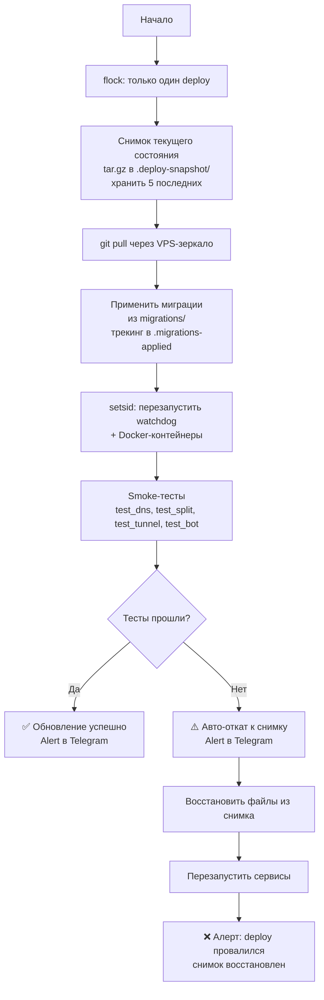

# Обновление системы

## Способы обновления

| Способ | Когда использовать |
|--------|-------------------|
| Автоматическое (Telegram-бот) | Основной способ, рекомендуется |
| Вручную через бота `/deploy` | Форсированное обновление |
| SSH + `deploy.sh` | Если бот недоступен |
| Rollback | При проблемах после обновления |

---

## Автоматическое обновление

Watchdog проверяет обновления **каждый час** через git-зеркало на VPS (не напрямую с GitHub — он может быть заблокирован).

При появлении новой версии бот присылает уведомление:

```
🔔 Доступно обновление: v1.3 → v1.4

📋 Что нового:
• Улучшена детекция шейпинга
• Исправлен баг с AWG peers
• Добавлен новый источник баз РКН
⚠️ Security-обновление

[Обновить] [Пропустить] [Подробнее]
```

- **[Обновить]** — запускает `deploy.sh` с автоматическим smoke-тестом
- **[Пропустить]** — напомнит через 24 часа
- **[Подробнее]** — показывает полный changelog

---

## Процесс обновления (deploy.sh)



### Особенности

- **flock:** только один deploy за раз, параллельные игнорируются
- **setsid:** watchdog перезапускается в новой сессии — переживает гибель родителя
- **Снимки:** хранятся 5 последних в `/opt/vpn/.deploy-snapshot/`
- **VPS:** обновляется по SSH после домашнего сервера
- **Security:** обновления отмечаются ⚠️, рекомендуется применить немедленно

---

## Ручное обновление через бота

```
/deploy            — обновить из git (создаёт снимок, smoke-тест, авто-откат)
/deploy --check    — показать что изменится (без применения)
/deploy --force    — обновить даже если нет новых коммитов
```

---

## Обновление через SSH

Если бот недоступен:

```bash
ssh sysadmin@<IP_ДОМАШНЕГО_СЕРВЕРА>
cd /opt/vpn

# Обычное обновление:
sudo bash deploy.sh

# С детальным выводом:
sudo bash deploy.sh 2>&1 | tee /tmp/deploy.log

# Проверить без применения:
sudo bash deploy.sh --check
```

---

## Откат

### Автоматический откат

При провале smoke-теста deploy.sh автоматически откатывается и сообщает в Telegram.

### Ручной откат через бота

```
/rollback          — откат к последнему снимку
/rollback список   — показать доступные снимки
```

### Ручной откат через SSH

```bash
sudo bash deploy.sh --rollback

# Или выбрать конкретный снимок:
sudo bash deploy.sh --rollback /opt/vpn/.deploy-snapshot/20240315_143022.tar.gz
```

---

## Обновление Docker-образов

Docker-образы зафиксированы по версии (image pinning). Обновление образов — отдельная операция:

```
/update    — обновить Docker-образы (покажет что изменится, требует подтверждение)
```

Или через SSH:
```bash
cd /opt/vpn
sudo docker compose pull
sudo docker compose up -d
```

> **Важно:** Обновление Docker-образов не обновляет код проекта (watchdog, бот, скрипты).
> Используйте `/deploy` для обновления кода, `/update` для обновления базовых образов.

---

## Обновление баз РКН

Базы обновляются автоматически в 03:00 каждую ночь.

Принудительное обновление:
```
/routes update    — обновить базы РКН прямо сейчас (async, займёт 1–2 мин)
```

Или через SSH:
```bash
sudo /opt/vpn/venv/bin/python3 /opt/vpn/home/scripts/update-routes.py --force
```

---

## Обновление только VPS

```
/migrate-vps <новый_IP>    — перенести всё на новый VPS
```

Или через SSH на домашнем сервере:
```bash
sudo bash deploy.sh --vps-only
```

---

## Миграции

При обновлении кода между версиями могут быть изменения БД или конфигов.
Миграции применяются автоматически в `deploy.sh`:

```
migrations/
├── 001_add_device_limit.sql      — изменение схемы SQLite
├── 002_add_excludes_table.sql
└── apply.sh                      — применяет непримeнённые миграции
```

Статус применённых миграций: `/opt/vpn/.migrations-applied`

---

## Обновление ОС

> ⚠️ **ЗАПРЕЩЕНО:** `do-release-upgrade` (Ubuntu 22.04 → 24.04 in-place)
> Это сломает DKMS-модули, конфиги, venv и другие компоненты.

**Правильный способ обновления ОС:**
1. Сделайте бэкап: `/vpn add` команды не нужны, `backup.sh` сохраняет всё
2. Установите Ubuntu 24.04 чистой установкой
3. Восстановите: `sudo bash restore.sh --from-backup vpn-backup-XXXXXX.tar.gz.gpg`

---

## Checklist после обновления

После каждого обновления проверьте:

```
/status           — туннель активен
/docker           — все контейнеры running/healthy
/speed            — скорость не деградировала
/check youtube.com — заблокированные сайты работают
```

Если что-то сломалось: `/rollback` или `sudo bash deploy.sh --rollback`
