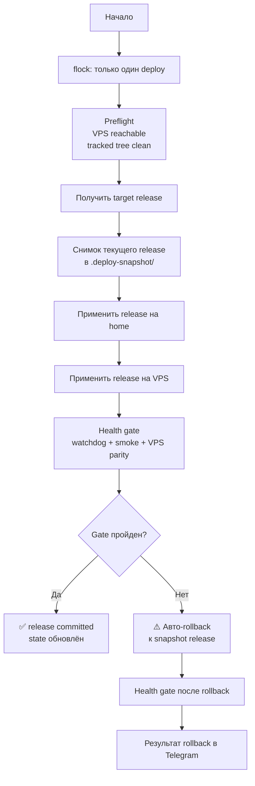

# Обновление системы

## Способы обновления

| Способ | Когда использовать |
|--------|-------------------|
| Автоматическое (Telegram-бот) | Основной способ, рекомендуется |
| Вручную через бота `/deploy` | Форсированное обновление |
| SSH + `deploy.sh` | Если бот недоступен |
| Rollback | При проблемах после обновления |

---

## Автоматическое обновление

Watchdog проверяет обновления **каждый час** через git-зеркало на VPS (не напрямую с GitHub — он может быть заблокирован).

При появлении новой версии бот присылает уведомление:

```
🔔 Доступно обновление: v1.3 → v1.4

📋 Что нового:
• Улучшена детекция шейпинга
• Исправлен баг с AWG peers
• Добавлен новый источник баз РКН
⚠️ Security-обновление

[Обновить] [Пропустить] [Подробнее]
```

- **[Обновить]** — запускает `deploy.sh` с автоматическим smoke-тестом
- **[Пропустить]** — напомнит через 24 часа
- **[Подробнее]** — показывает полный changelog

---

## Процесс обновления (deploy.sh)



### Особенности

- **flock:** только один deploy за раз, параллельные игнорируются
- **Release state:** текущее и pending состояние хранятся в `/opt/vpn/.deploy-state/`
- **State contract:** schema и terminal statuses описаны в `docs/DEPLOY-STATE.md`
- **Снимки:** хранятся 5 последних в `/opt/vpn/.deploy-snapshot/`
- **Consistency-first:** release не принимается, пока home и VPS не подтверждены одним health gate
- **Security:** обновления отмечаются ⚠️, рекомендуется применить немедленно

---

## Ручное обновление через бота

```
/deploy            — обновить из git (создаёт снимок, smoke-тест, авто-откат)
/deploy --check    — показать что изменится (без применения)
/deploy --force    — обновить даже если нет новых коммитов
```

---

## Обновление через SSH

Если бот недоступен:

```bash
ssh sysadmin@<IP_ДОМАШНЕГО_СЕРВЕРА>
cd /opt/vpn

# Обычное обновление:
sudo bash deploy.sh

# С детальным выводом:
sudo bash deploy.sh 2>&1 | tee /tmp/deploy.log

# Проверить без применения:
sudo bash deploy.sh --check
```

---

## Откат

### Автоматический откат

При любом unsafe state после начала apply deploy.sh автоматически откатывается и сообщает в Telegram.

### Ручной откат через бота

```
/rollback          — откат к последнему снимку
```

### Ручной откат через SSH

```bash
sudo bash deploy.sh --rollback
```

---

## Обновление Docker-образов

Docker-образы зафиксированы по версии (image pinning). Обновление образов — отдельная операция:

```
/update    — обновить Docker-образы (покажет что изменится, требует подтверждение)
```

Или через SSH:
```bash
cd /opt/vpn
sudo docker compose pull
sudo docker compose up -d
```

> **Важно:** Обновление Docker-образов не обновляет код проекта (watchdog, бот, скрипты).
> Используйте `/deploy` для обновления кода, `/update` для обновления базовых образов.

---

## Обновление баз РКН

Базы обновляются автоматически в 03:00 каждую ночь.

Принудительное обновление:
```
/routes update    — обновить базы РКН прямо сейчас (async, займёт 1–2 мин)
```

Или через SSH:
```bash
sudo python3 /opt/vpn/scripts/update-routes.py --force
```

Что ещё обновляется вместе с маршрутами:
- `vpn-latency-sensitive.conf`
- direct-first routing для доменов из latency catalog
- learned latency-sensitive домены из `/etc/vpn-routes/latency-learned.txt`

Отдельно можно пересобрать runtime catalog без `deploy.sh`:

```bash
sudo python3 /opt/vpn/scripts/update-latency-catalog.py
sudo python3 /opt/vpn/scripts/update-routes.py
sudo systemctl restart watchdog
```

---

## Отдельная миграция VPS

Для DR/миграции используйте `restore.sh --migrate-vps <IP>`.
`deploy.sh` больше не поддерживает отдельный `--vps-only`: release считается успешным только при согласованном состоянии home + VPS.

---

## Миграции

При обновлении кода между версиями могут быть изменения БД или конфигов.
Миграции применяются автоматически в `deploy.sh`:

```
migrations/
├── 001_add_device_limit.sql      — изменение схемы SQLite
├── 002_add_excludes_table.sql
└── apply.sh                      — применяет непримeнённые миграции
```

Статус применённых миграций: `/opt/vpn/.migrations-applied`

---

## Обновление ОС

> ⚠️ **ЗАПРЕЩЕНО:** `do-release-upgrade` (Ubuntu 22.04 → 24.04 in-place)
> Это сломает DKMS-модули, конфиги, venv и другие компоненты.

**Правильный способ обновления ОС:**
1. Сделайте бэкап: `/vpn add` команды не нужны, `backup.sh` сохраняет всё
2. Установите Ubuntu 24.04 чистой установкой
3. Восстановите: `sudo bash restore.sh --full-restore vpn-backup-XXXXXX.tar.gz.gpg`

---

## Checklist после обновления

После каждого обновления проверьте:

```
/status           — туннель активен
/docker           — все контейнеры running/healthy
/speed            — скорость не деградировала
/check youtube.com — заблокированные сайты работают
```

Если сломался release: `/rollback` или `sudo bash deploy.sh --rollback`
Если нужен disaster recovery из архивного бэкапа: `sudo bash restore.sh --full-restore <backup>`

---

## Восстановление после сбоя (Disaster Recovery)

### Хранение бэкапов

| Расположение | Путь | TTL |
|--------------|------|-----|
| Домашний сервер | `/opt/vpn/backups/vpn-backup-*.tar.gz.gpg` | 30 дней |
| VPS | `/opt/vpn/backups/vpn-backup-*.tar.gz.gpg` | 30 дней |
| Telegram | Сообщение от бота в чате с собой | Навсегда |

GPG-passphrase: переменная `BACKUP_GPG_PASSPHRASE` из `.env`. Если `.env` утерян — нужен passphrase из Telegram-бэкапа.

---

### Сценарий 1: Домашний сервер вышел из строя

**Время восстановления: ~40–60 минут**

1. Установить Ubuntu Server 24.04 на новое железо (пользователь `sysadmin`, OpenSSH, Ethernet, тот же LAN IP)
2. Получить бэкап с VPS: `scp -i ~/.ssh/vpn_vps sysadmin@<VPS_IP>:/opt/vpn/backups/vpn-backup-<DATE>.tar.gz.gpg ~/`
3. Запустить восстановление:
```bash
curl -sO https://raw.githubusercontent.com/Cyrillicspb/vpn-infra/master/restore.sh
sudo bash restore.sh vpn-backup-YYYYMMDD_HHMMSS.tar.gz.gpg
```

`restore.sh` расшифрует бэкап, проверит sha256 и восстановит компоненты в правильном порядке. Это DR-механизм, а не release rollback.

---

### Сценарий 2: Повреждена ОС (сервер жив)

**Время восстановления: ~20–30 минут**

```bash
# Откат к снимку deploy:
sudo bash /opt/vpn/deploy.sh --rollback

# Восстановление из бэкапа:
sudo bash restore.sh --full-restore /opt/vpn/backups/vpn-backup-<LATEST>.tar.gz.gpg

# DKMS слетел после обновления ядра:
sudo apt install linux-headers-$(uname -r)
sudo dkms install amneziawg -v $(dkms status | grep amneziawg | awk '{print $2}' | tr -d ',')
sudo systemctl restart awg-quick@wg0 wg-quick@wg1
```

---

### Сценарий 3: VPS недоступен

При недоступности VPS все 4 стека не работают — нет автоматического аварийного режима без VPS.

```bash
# Диагностика:
ping <VPS_IP> -c 5
ssh -i /root/.ssh/vpn_id_ed25519 sysadmin@<VPS_IP>
```

Если VPS завис: войдите в веб-консоль провайдера (Hetzner Console, Vultr VNC) → Hard reset VM → `docker compose up -d`.

---

### Сценарий 4: Смена VPS

```
/migrate_vps <IP_НОВОГО_VPS>
```

Бот установит Docker, скопирует конфиги, поднимет сервисы, протестирует стеки и разошлёт новые конфиги клиентам. Если DDNS настроен — клиентам ничего делать не нужно.

```bash
# Через restore.sh:
sudo bash restore.sh --migrate-vps <НОВЫЙ_VPS_IP>
```

---

### Сценарий 5: Компрометация ключей

```bash
# Немедленно через бота:
/rotate_keys
```

`/rotate_keys` сгенерирует новые ключи для сервера и всех пиров, разошлёт новые конфиги клиентам, перезапустит WireGuard.

```bash
# Проверить нет ли посторонних peers:
sudo wg show wg0 && sudo wg show wg1
# Проверить authorized_keys:
cat /home/sysadmin/.ssh/authorized_keys
# Проверить логи входов:
last -n 30
```

---

### Быстрый старт: команды восстановления

```bash
# Полное восстановление из бэкапа:
sudo bash restore.sh --full-restore <ФАЙЛ_БЕКАПА>

# Откат deploy:
sudo bash deploy.sh --rollback

# Миграция VPS:
sudo bash restore.sh --migrate-vps <IP>
```

### RTO / RPO

| Сценарий | RTO | RPO |
|----------|-----|-----|
| Повреждены конфиги, ОС цела | 10–15 мин | 0 |
| Новое железо + бэкап | 40–60 мин | ≤24 ч |
| Смена VPS | 15–30 мин | 0 |
| Утеря обоих серверов | 60–90 мин | ≤24 ч |
| Компрометация ключей | 5 мин | 0 |
